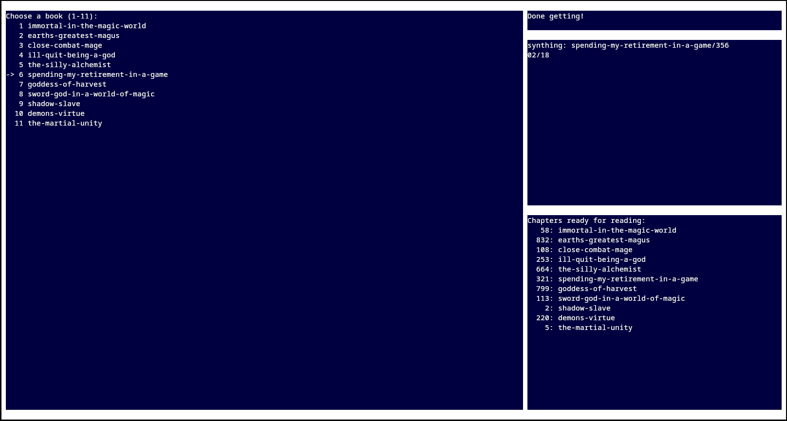
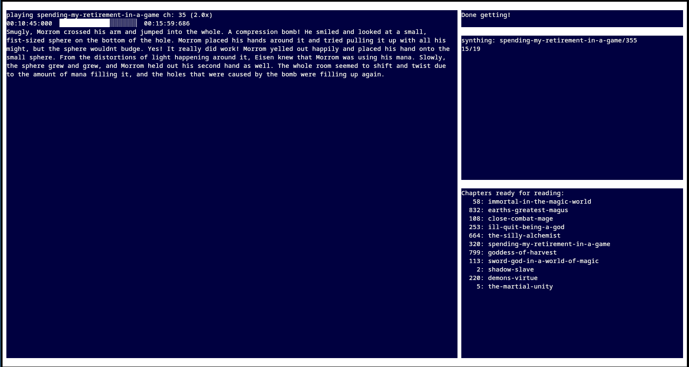

# playa
An application for creating text to speach for webnovels and playing that speach back with subtitles.



## Requirements
python3

pip installed requirements.txt 

ffmpeg

ffprobe  

ffplay

espeak 

## Setup
```
git clone https://github.com/AceMouse/playa.git && cd playa
```
Using the uv package manager. 
```
uv venv env
source env/bin/activate
uv pip install -r requirements.txt
```
## Adding a book entry:
This only works if you can navigate between chapters using the arrow keys on the book site and only if the text shows up in firefox reader mode e.g. plain text.
```
./env/bin/python add.py 
```

## Running the application 
Add g to get new chapters s to synthesise p to enable the player and x to show book stats. 

Default is all enabled.
```
./env/bin/python run.py <optional:gspx> 
```

## Clean read chapters
With preserve being the amount of chapters to preserve before the current one. 
```
./env/bin/python clean.py <preserve> 
```
## Move read, synth and getter heads
Edit pch and t to adjust the chapter and time offset to read from.

Edit tch and url to adjust the chapter to get from the web. 

Edit sch to adjust which chapter to synthesise next. 

Best practise is to remove already gotten and synthesised chapters after the head by editing the files in the output directory. 

```
./env/bin/python edit.py
```

## key bindings
### When selecting a book to play:
Press t at any time to quit the application.

Now you can navigate the booklist by pressing w and s to go up and down or type a the number of the book. 

Press space or enter to select a book to listen to.

### While a book is playing:
Press t at any time to return to book selection.

Controll naration speed by pressing w and s to speed up and down. 

Press space to pause.

Press j and k to jump forwards or backwards. 

Press b to turn of screen backlight, press any key to turn back on.

## OS support
Only tested on arch linux. 

## Contributing
Open an issue and let's discuss before a pull request is made. 
